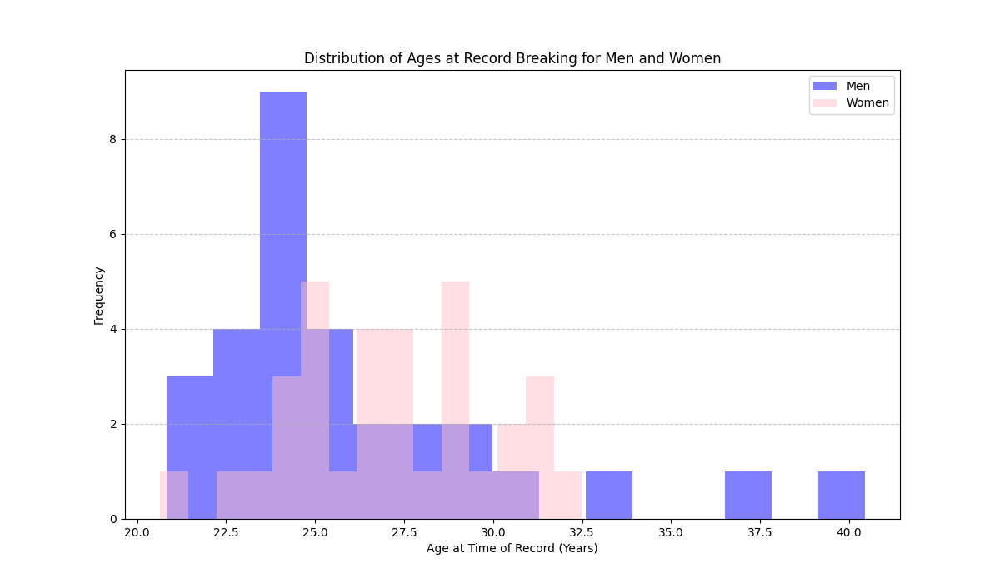
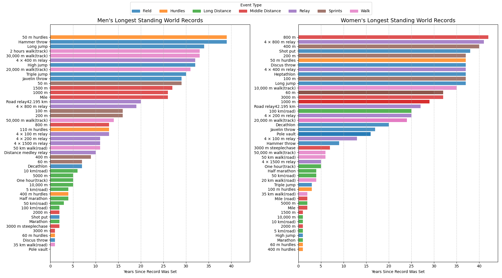
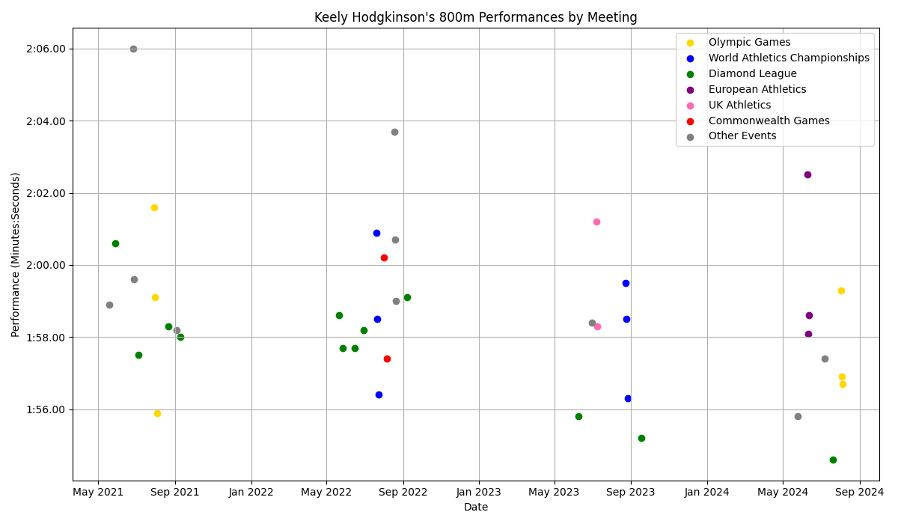
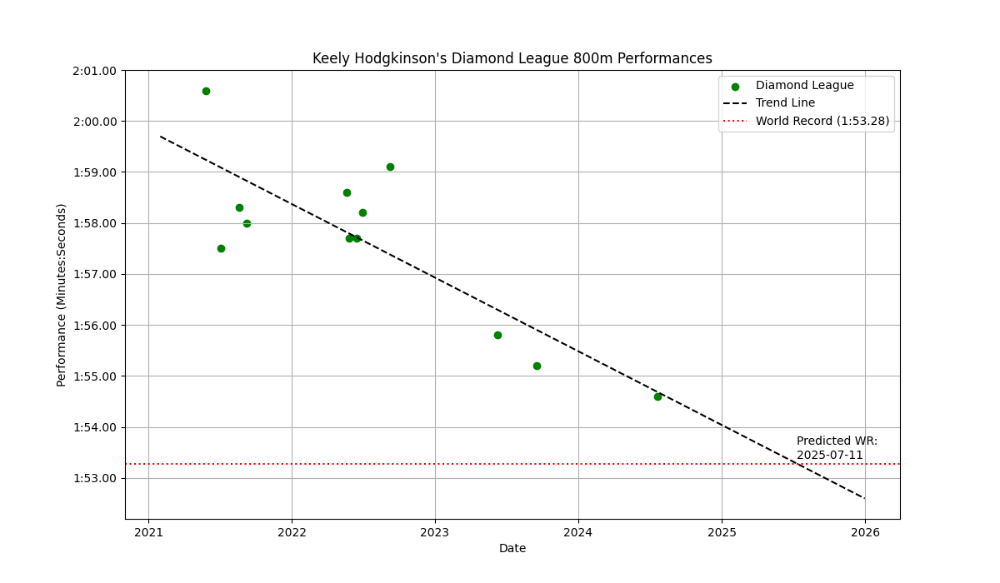

# Records Are Made to Be Broken — But How, When, and By Whom?

What separates the fleeting records from the ones that stand the test of time? Is record-breaking an art, a science, or sheer luck?

When people think of world records, and the pinnacle of sporting achievement, iconic events like the 100m sprint or marathon often come to mind: many people (sports fans or not) can easily recite Bolt's famous record of 9.58s recorded in Berlin in 2009, or Kipchoge's astonishing sub 2-hour effort in Vienna, 2019. 

We already know that marginal gains are everything, from carbon-plated shoes to altitude training, and allow the athletes of today to constantly evolve their sports, but this blog post dives into the data behind the numbers to uncover what else makes a record breaker. This post explores how factors like age, timing, nationality, and event type play into world record performances, and aims to uncover the recipe to success through an exciting case study of one of the greatest rising stars of athletics in years.  

## How the Olympics Inspire Record Breakers

Success at the Olympics is the ultimate goal for any athlete. As the most prestigious event in sport which only comes around once every four years, the weight of the games is incomparable to any other championships. As a result of this, athletes do not simply train their hardest 365 days a year: instead they meticulously structure their training cycles to physically peak at the right times, particularly for annual World Championships and of course every four years for the Olympics. In these moments of peak form and huge pressure is when athletes give the performance of a lifetime and, ultimately, records are broken.

The bar chart in Figure 1 illustrates how current world records reflect this, whle taking into account the anomalous Games of Tokyo 2021, which were delayed due to the COVID-19 pandemic, which would have upset training cycles hugely.

If Olympic years were like any other, we would expect to see around 25% on world records set during those years. Strikingly, for women's events this number is nearly double the expected rate at 43.9%, highlighting how training is tailored in order to produce the best performances when it really counts. Male records still demonstrate this, although not as dramatically as the females, since it only exceeds the 25% mark by 5.6%.

This shows how athletes (and women in particular) are timing their peak performances to coincide with the Games. However, training cycles are not the only factor in setting a world record: let's dive a little deeper into how demographics and event type affect how 'breakable' a record really is.

## How Wide is the Gender Gap?

It is well established that, due to biological and physiological differences, men tend to outperform women in many physical disciplines, and hence their separation in sporting competitions. But just how big is that performance gap, and does it vary across events?

As shown in Figure 2, the percentage difference between men’s and women’s world records does vary by discipline. Percentage values are calculated as ((W - M) / M) × 100 for timed track events, and ((M - W) / W) × 100 for distance measured field events. In both cases, positive values represent how much men outperform women, relative to the men's record.

On the track, differences remain consistent a around 10-11%, although the discrepancy peaks at 12.26% for the 800m, while the marathon shows only a 7% time increase on the men's. This could be indicative of women having some kind of advantage in endurance, such as better energy conservation or aerobic efficiency. 

For field events, the male to female performance margins vary much more widely. The men's javelin throw record is 36% better than that of the women, while jumping events are not far behind. Incredibly, the women's discus record -- which has stood since 1988 -- is 3% better than the men's, and is the only athletics record to achieve such a feat. During this era, many athletes either tested positive for or later admitted to taking anabolic steroids, and so speculation remains over the use of performance enhancing drugs before the implementation of the IAAF's increased doping control measures in 2005. Despite this, many records still stand as without definitive proof it would be difficult to remove a record entirely. 

In contrast, the men's pole vault record is being broken almost constantly, with Swedish superstar Armand "Mondo" Duplantis currently in the form of his life, having already broken the world record a total of eleven times in his career. Hence, the gender gap for this event (which currently stands at 23.91%) may increase even further as Duplantis continues to raise the bar — quite literally. At just 25, Mondo is already in peak form, still with potential to improve. But when do other record breakers typically peak in their careers?

## The Prime Time of an Athlete

Due to limitations in the available age data, this section covers roughly half of the total events analysed in the rest of the report. However, it does ensure a relatively even spread of data across event groups.

Figure 3's distribution plot shows that men's data is densely clustered with dramatic outliers, while female data has less extreme values but is generally wider spread. From the breakdown in Table 1, we see that on average, men tend to set records at the slightly younger age of 26.27, compared to the female 26.94. But how does this vary across events?

  <figure>
    
    <figcaption>Table 1: Mean, Median, Minimum, and Maximum Ages</figcaption>
  </figure>
  <figure>
    
    <figcaption>Figure 3: Age Distribution of Record Breakers</figcaption>
  </figure>

Given the above categories, we can see that male track events tend to produce the youngest record breakers, all with mean ages of 23-24 years, significantly smaller than that of any other category. On the other hand, race walking appears to be dominated by older athletes, with nearly all values being in their early to mid-30s, indicating that experience is an advantage within this discipline. Given that walking is an endurance event where athletes improve with age, this is a stark contrast to running endurance disciplines, where younger athletes thrive. This could be to do with the toll that running marathons and similar events take on the joints and soft tissues, and maybe athletes simply cannot perform for sustained periods of time. 

However, there are exceptions to every rule: namely the marathon star, Eliud Kipchoge. At the age of 34, he famously completed an unofficial sub-2-hour marathon, and achieved the impossible, showing he has only progressed with age. The late Kelvin Kiptum holds the current record which he set at just 23: his loss was so great to athletics, and it is a tragedy that we do not know if he could have followed in Eliud's footsteps (officially) one day.

Now that we have explored the age at which athletes break records, let's look at the ages of the records themselves. How long do these last, and why are some so hard to break? 

## 1983 to Now: The Longest Standing Records in Athletics

The figure shows that now is a particularly exciting time for men’s long-distance running, indicated by the collection of green bars in the bottom left hand corner of the plot. In fact, the longest standing record of this kind was only recently set in December, 2019: the 10 km road record set by Joshua Cheptegei in Valencia. Despite a global pandemic shortly after this, distance athletes were still able to train, since they didn't require track or specific equipment, unlike pole vault for example which is difficult to train from home. Hence, world records in these disciplines have been consistently improved since this period.

Returning to men's pole vault, Mondo Duplantis is the most recent record breaker, since he cleared a height of 6.27 metres on February 28, 2025, at the All Star Perche in Clermont-Ferrand, France. He first broke the record in February 2020, which he has since bettered by 10cm, and -- as previously discussed -- this number is only likely to improve.

Notably, the women's 800m world record has lasted a staggering 42 years, since Jarmila Kratochvílová's stunning performance where she clocked a time of 1:53.28 in Munich in 1983. Although this record is ratified, it has remained shrouded in speculation, since Kratochvílová faced doping allegations for much of her career, while she claimed training and B12 were key to her success. Regardless of whether or not drugs were involved, the record still stands, and the question turns to ask who will break this record? 

## Is the Unbreakable soon to be Broken?

The current women's 800m Olympic champion -- Great Britain's golden girl Keely Hodgkinson -- looks to be a serious contender. She is the fastest European this century, and recently ran a personal best over 800m of 1:54.61 in July, 2024. After losing out to USA's Athing Mu to secure silver at the Tokyo Olympics, Keely won gold at Paris 2024, although without Athing at her side as a result of a fall at her Olympic trial. The pair have a great rivalry, pushing each other to give their best performances and making the sport an absolute thrill for spectators. With Keely and Athing placed at 6th and 9th, respectively, in the all-time list aged just 22 and 21 at the times of racing, prospects are looking promising for these young talents and their seemingly impossible task of breaking THAT record.

The following plot -- which takes into account all of Keely's Domestic and Major Championship performances, colour coded by championship -- does indeed show a gradual progression in her 800m times since May 2021. If this steady progress continued, we could expect her to break the world record at some time in 2031, one year before the 2032 Brisbane Olympic Games. However, this is not an accurate representation of her best efforts: Keely can win a UK Athletics Championship more comfortably than an Olympic Gold, for example, and so maybe focus needs to pinpoint on where the stakes are highest, or where she runs her fastest, with the pressure of Athing Mu at her side.

### Shining Bright at the Diamond League

Keely performs her best at Diamond League outings, where she notably recorded her aforementioned PB at the London Athletics Meet in July 2024. 

Performing an Ordinary Least Squares (OLS) Regression on just her Diamond League performances, it is important to note that Keely's progress is assumed to be linear, and the model does not account for injuries or potential tactics. The trend reveals the exciting prospect of a very soon new World Record, with an intersection at 11th July, 2025. This lines up almost perfectly with this year's Diamond League London Athletics Meet, which takes place on 19th July, 2025. 

table **

The coefficients of the model, shown in Table 2, reveal that it has a high R^2 value -- i.e. 67.9% of the variance in results is explained by the model -- as well as a small p-value, meaning it is indeed statistically significant. The gradient indicates a rough improvement of 0.004 sec/day.
In July, Keely will be just 23 years old, where the mean female middle distance WR holder is 28. If she defies this statistic that would be a huge feat, however the initial 2031 prediction would indeed be when she is 29, so potentially reaching her prime at this age instead. In fact, Jarmila Kratochvílová was 32 in 1983, so either option seems realistic. 

So, the data adds up, and alongside the advantage of performing in front of a home crowd  -- coud this be the perfect recipe for Keely to finally break the 800m women's world record? She has indeed been confirmed as a runner, but (at time of writing) Athing Mu has not yet confirmed her schedule: fingers crossed she is on that start line, and the duo can push each other to pull off something magical.

## The Future of Athletics

Athletics is a fantastic spectator sport, from 100m to the marathon to heptathlon. The emergence of these new superstars with the likes of Keely Hodgkinson and Armand Duplantis within the less typically popular disciplines, who have captured the media and the wider world's attention, can only mean great things for the sport and where the records are headed. And with current mile record holder Faith Kipyegon's recent announcement that she will be attempting to break the 4-minute mile on 26th June, we are definitely in an era of the greats.

So, set those reminders for 26th June and 19th July, sit back, and get ready to witness history.